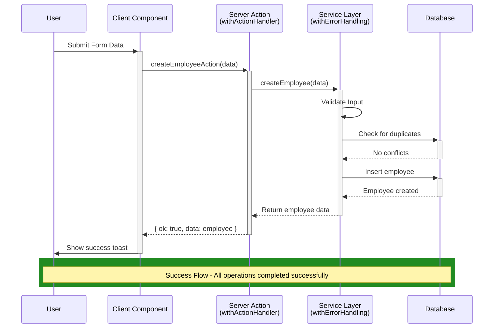
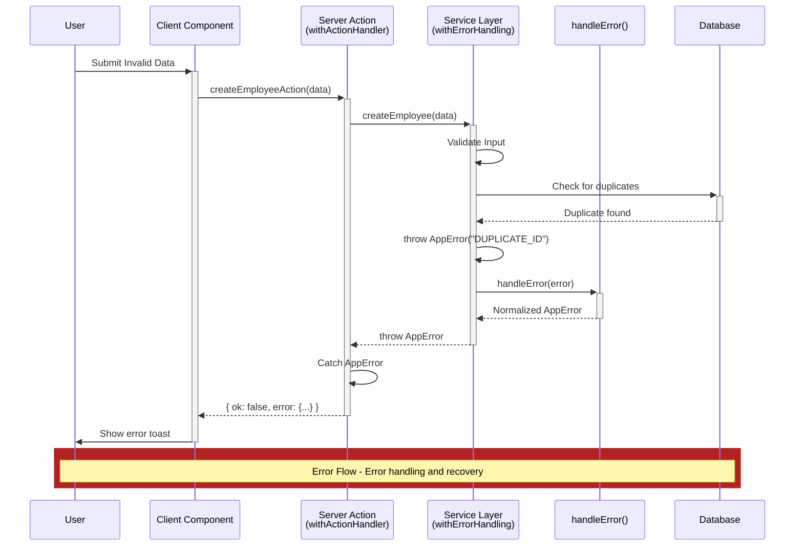

# Next.js Layered Error System Boilerplate

โปรเจคตัวอย่างการใช้งาน **Layered Error System** ในแอปพลิเคชัน Next.js เพื่อจัดการข้อผิดพลาดอย่างมีระบบและคาดเดาได้

## แนวคิดหลักของ Layered Error System

ระบบจัดการข้อผิดพลาดแบบชั้น (Layered) ช่วยให้เราสามารถควบคุมและจัดการ error ได้อย่างเป็นระบบ โดยแบ่งออกเป็น 4 ชั้นหลัก:

```
Client/API Layer → withActionHandler() → AppError() → handleError() → withErrorHandling() → Service Layer
```

### องค์ประกอบหลัก

1. **`AppError()`** - คลาสสำหรับสร้าง custom error ที่เราควบคุมได้
2. **`handleError()`** - ฟังก์ชันแปลงทุก error ให้เป็นรูปแบบเดียวกัน
3. **`withErrorHandling()`** - wrapper สำหรับ service/function ให้จัดการ error อัตโนมัติ
4. **`withActionHandler()`** - wrapper สำหรับ Server Actions ให้คืน response ที่ปลอดภัย

## โครงสร้างโปรเจค

```
├── lib/errors/           # ระบบจัดการ error หลัก
│   ├── AppError.ts       # คลาส custom error
│   ├── handleError.ts    # ฟังก์ชันแปลง error
│   ├── withErrorHandling.ts # wrapper สำหรับ services
│   └── withActionHandler.ts # wrapper สำหรับ actions
├── services/             # Business logic layer
│   └── employeeService.ts
├── actions/              # Server Actions layer
│   ├── createEmployee.ts
│   ├── getEmployee.ts
│   └── deleteEmployee.ts
└── components/           # UI Components
    └── toast-list.tsx    # แสดงข้อความ error
```

## วิธีการทำงานของแต่ละชั้นอย่างละเอียด

### 1. AppError Class (`lib/errors/AppError.ts`)

คลาสสำหรับสร้าง error ที่เราควบคุมได้ พร้อมกับ code, status และ metadata

```typescript
export class AppError extends Error {
  readonly code: string
  readonly status: number
  readonly meta?: Record<string, unknown>

  constructor(
    code: string,
    message?: string,
    status = 400,
    meta?: Record<string, unknown>
  ) {
    super(message ?? code)
    this.code = code
    this.status = status
    this.meta = meta
  }
}
```

**การใช้งาน:**
```typescript
// Error พื้นฐาน
throw new AppError("NOT_FOUND", "ไม่พบพนักงาน", 404)

// Error พร้อมข้อมูลเพิ่มเติม
throw new AppError("INVALID_INPUT", "ข้อมูลไม่ถูกต้อง", 400, {
  field: "name",
  value: "",
  required: true
})

// Validation error
throw new AppError("VALIDATION_ERROR", "รูปแบบอีเมลไม่ถูกต้อง", 422, {
  field: "email",
  pattern: "user@domain.com"
})
```

**คุณสมบัติ:**
- `code`: รหัส error ที่กำหนดเอง (เช่น "NOT_FOUND") - ใช้สำหรับการจัดการใน code
- `message`: ข้อความอธิบาย error ที่แสดงให้ผู้ใช้ดู
- `status`: HTTP status code (default: 400) - ใช้กำหนด response status
- `meta`: ข้อมูลเพิ่มเติม (optional) - เก็บ context หรือ debugging info

**ประโยชน์:**
- สร้าง error ที่มีโครงสร้างเดียวกันทั่วทั้งแอป
- ง่ายต่อการ serialize เป็น JSON
- รองรับ metadata สำหรับ debugging
- Type-safe กับ TypeScript

### 2. handleError Function (`lib/errors/handleError.ts`)

ฟังก์ชันที่แปลงทุก error (AppError, Error, หรืออื่นๆ) ให้เป็น AppError เสมอ เพื่อให้การจัดการ error มีความสม่ำเสมอ

```typescript
export function handleError(error: unknown): AppError {
  if (error instanceof AppError) return error
  if (error instanceof Error) {
    console.error("[Unhandled Error]", error)
    return new AppError("INTERNAL_ERROR", error.message, 500)
  }
  return new AppError("UNKNOWN_ERROR", "Unexpected error", 500)
}
```

**การใช้งาน:**
```typescript
try {
  // โค้ดที่อาจเกิด error
  await someRiskyOperation()
} catch (error) {
  const normalizedError = handleError(error) // ได้ AppError เสมอ
  throw normalizedError
}
```

**หน้าที่และการทำงาน:**
1. **AppError Passthrough**: ถ้าเป็น AppError แล้ว → ส่งผ่านไปเลย (ไม่แปลง)
2. **Error Normalization**: ถ้าเป็น Error ทั่วไป → แปลงเป็น AppError พร้อม log
3. **Unknown Error Handling**: ถ้าเป็นอย่างอื่น → สร้าง AppError ใหม่
4. **Logging**: บันทึก error ที่ไม่คาดคิดเพื่อ debugging

**ประโยชน์:**
- รับประกันว่าทุก error จะเป็น AppError
- มี logging อัตโนมัติสำหรับ unexpected errors
- ป้องกัน sensitive information leak
- ทำให้ error handling ที่ layer บนง่ายขึ้น

### 3. withErrorHandling Wrapper (`lib/errors/withErrorHandling.ts`)

Higher-Order Function ที่ห่อ service functions ให้จัดการ error อัตโนมัติ โดยจับทุก error และแปลงให้เป็น AppError

```typescript
export function withErrorHandling<Args extends unknown[], ReturnType>(
  fn: (...args: Args) => Promise<ReturnType>
) {
  return async (...args: Args): Promise<ReturnType> => {
    try {
      return await fn(...args)
    } catch (err) {
      throw handleError(err)
    }
  }
}
```

**การใช้งาน:**
```typescript
// Service ที่ไม่มี error handling
async function rawCreateEmployee(data: CreateEmployeeInput) {
  if (!data.name) throw new Error("Employee name required") // อาจเป็น Error ปกติ
  if (!data.employeeId) throw new AppError("INVALID_INPUT", "รหัสพนักงานไม่ถูกต้อง")

  // Database operation ที่อาจ throw error
  return await db.employee.create({ data })
}

// Wrap ด้วย withErrorHandling
export const createEmployee = withErrorHandling(rawCreateEmployee)

// ตอนใช้งาน
try {
  const employee = await createEmployee(data)
  // สำเร็จ
} catch (error) {
  // รับประกันว่าเป็น AppError เสมอ
  console.log(error.code)    // INVALID_ID หรือ INTERNAL_ERROR
  console.log(error.message) // ข้อความที่เหมาะสม
}
```

**ตัวอย่างการใช้งานจริง:**
```typescript
// services/employeeService.ts
export const getEmployeeById = withErrorHandling(async (id: number) => {
  if (!id || id <= 0) {
    throw new AppError("INVALID_ID", "รหัสพนักงานไม่ถูกต้อง", 400)
  }

  const employee = await db.employee.findUnique({ where: { id } })

  if (!employee) {
    throw new AppError("NOT_FOUND", "ไม่พบพนักงาน", 404)
  }

  return employee
})

export const updateEmployee = withErrorHandling(async (id: number, data: UpdateData) => {
  // Validation
  if (!data.name?.trim()) {
    throw new AppError("INVALID_NAME", "ชื่อไม่ถูกต้อง", 400)
  }

  // Check existence
  await getEmployeeById(id) // จะ throw AppError ถ้าไม่เจอ

  // Update (อาจ throw database error)
  return await db.employee.update({ where: { id }, data })
})
```

**ประโยชน์:**
- **Auto Error Normalization**: จับ error ทุกตัวและแปลงเป็น AppError อัตโนมัติ
- **Cleaner Service Code**: ไม่ต้องเขียน try-catch ซ้ำๆ ในทุก service
- **Consistent Error Format**: รับประกันว่าทุก service จะ throw AppError เสมอ
- **Easy to Debug**: มี error logging อัตโนมัติ
- **Type Safety**: รักษา type signature ของฟังก์ชันเดิม

### 4. withActionHandler Wrapper (`lib/errors/withActionHandler.ts`)

Higher-Order Function สำหรับ Server Actions ที่แปลง error เป็น Result Pattern แทนการ throw exception เพื่อให้ client จัดการได้ง่าย

```typescript
// Type definitions
export type ActionResponse<T> =
  | { ok: true; data: T }
  | { ok: false; error: { code: string; message: string } }

export const withActionHandler = <Args extends unknown[], ReturnType>(
  fn: (...args: Args) => Promise<ReturnType>
) => {
  return async (...args: Args): Promise<ActionResponse<ReturnType>> => {
    try {
      const data = await fn(...args)
      return { ok: true, data }
    } catch (err) {
      const error = handleError(err)
      return { ok: false, error: { code: error.code, message: error.message } }
    }
  }
}
```

**การใช้งาน:**
```typescript
// actions/createEmployee.ts
"use server"

import { withActionHandler } from "@/lib/errors/withActionHandler"
import { createEmployee } from "@/services/employeeService"
import { CreateEmployeeInput } from "@/types/employee"

// Wrap service ด้วย withActionHandler
export const createEmployeeAction = withActionHandler(async (data: CreateEmployeeInput) => {
  return createEmployee(data) // service อาจ throw AppError
})

// actions/getEmployee.ts
export const getEmployeesAction = withActionHandler(async () => {
  return getAllEmployees()
})

export const getEmployeeByIdAction = withActionHandler(async (id: number) => {
  return getEmployeeById(id)
})
```

**การใช้งานใน Client Component:**
```typescript
// components/EmployeeForm.tsx
"use client"

import { createEmployeeAction } from "@/actions/createEmployee"

export function EmployeeForm() {
  const handleSubmit = async (formData: FormData) => {
    const data = {
      name: formData.get("name") as string,
      employeeId: formData.get("employeeId") as string,
      department: formData.get("department") as string
    }

    const result = await createEmployeeAction(data)

    if (result.ok) {
      // สำเร็จ - มี type safety
      console.log("Created employee:", result.data.name)
      addToast(`เพิ่ม ${result.data.name} สำเร็จ`, "success")
      setEmployee(defaultEmployee) // reset form
    } else {
      // มี error - ใช้ message จาก AppError โดยตรง
      addToast(result.error.message, "error")
    }
  }

  // ... JSX
}
```

**Response Format:**
```typescript
// Success Response
{
  ok: true,
  data: {
    id: 1,
    name: "สมชาย ใจดี",
    employeeId: "EMP001",
    department: "IT"
  }
}

// Error Response
{
  ok: false,
  error: {
    code: "DUPLICATE_EMPLOYEE_ID",
    message: "รหัสพนักงานนี้มีอยู่แล้ว"
  }
}
```

**ประโยชน์:**
- **Result Pattern**: ไม่ throw exception ทำให้ client ปลอดภัย
- **Type Safety**: TypeScript รู้ว่า response จะเป็น success หรือ error
- **Predictable Response**: รูปแบบ response เดียวกันทุก action
- **Easy Error Handling**: client จัดการ error ได้ง่าย
- **No Try-Catch on Client**: client ไม่ต้องเขียน try-catch
- **Serializable**: response เป็น plain object ส่งผ่าน network ได้

## Flow การทำงานของระบบอย่างละเอียด

### Sequence Diagrams (Technical View)

#### Success Flow - Sequence Diagram


#### Error Flow - Sequence Diagram


### ตัวอย่างการทำงานแบบ Step-by-Step

**Scenario: User พยายามสร้างพนักงานที่มีรหัสซ้ำ**

```typescript
// 1. User Submit Form
const formData = {
  name: "สมชาย ใจดี",
  employeeId: "EMP001", // รหัสที่มีอยู่แล้ว
  department: "IT"
}

// 2. Client เรียก Action
const result = await createEmployeeAction(formData)

// 3. withActionHandler เรียก Service
export const createEmployeeAction = withActionHandler(async (data) => {
  return createEmployee(data) // เรียก service
})

// 4. withErrorHandling เรียก Business Logic
export const createEmployee = withErrorHandling(async (data) => {
  // 5. Validation ใน Service
  if (!data.name) throw new AppError("INVALID_NAME", "ต้องระบุชื่อ")

  // 6. Check duplicate
  const existing = await db.employee.findUnique({
    where: { employeeId: data.employeeId }
  })

  if (existing) {
    // 7. Service throw AppError
    throw new AppError("DUPLICATE_EMPLOYEE_ID", "รหัสพนักงานนี้มีอยู่แล้ว", 409)
  }
})

// 8. withErrorHandling จับ AppError
catch (error) {
  throw handleError(error) // ส่งต่อ AppError (ไม่แปลงเพราะเป็น AppError แล้ว)
}

// 9. withActionHandler จับ AppError
catch (error) {
  const appError = handleError(error)
  return {
    ok: false,
    error: {
      code: "DUPLICATE_EMPLOYEE_ID",
      message: "รหัสพนักงานนี้มีอยู่แล้ว"
    }
  }
}

// 10. Client ได้ response
if (result.ok) {
  // ไม่เข้าเพราะ ok = false
} else {
  // 11. แสดง error ใน UI
  addToast(result.error.message, "error") // "รหัสพนักงานนี้มีอยู่แล้ว"
}
```

## ตัวอย่างการใช้งานแบบ Step-by-Step

### 1. การสร้าง Service ใหม่

```typescript
// services/userService.ts
import { AppError } from "@/lib/errors/AppError"
import { withErrorHandling } from "@/lib/errors/withErrorHandling"

// Raw function (ไม่มี error handling wrapper)
async function rawCreateUser(userData: CreateUserData) {
  // Input validation
  if (!userData.email?.trim()) {
    throw new AppError("INVALID_EMAIL", "กรุณาระบุอีเมล", 400)
  }

  if (!userData.email.includes("@")) {
    throw new AppError("INVALID_EMAIL_FORMAT", "รูปแบบอีเมลไม่ถูกต้อง", 400)
  }

  if (!userData.name?.trim()) {
    throw new AppError("INVALID_NAME", "กรุณาระบุชื่อ", 400)
  }

  // Business validation
  const existingUser = await db.user.findUnique({
    where: { email: userData.email }
  })

  if (existingUser) {
    throw new AppError("USER_EXISTS", "อีเมลนี้ถูกใช้งานแล้ว", 409)
  }

  // Database operation (ไม่ต้อง try-catch เพราะ withErrorHandling จัดการให้)
  // หาก database error เกิดขึ้น withErrorHandling จะจับและแปลงให้เป็น AppError
  return await db.user.create({
    data: {
      email: userData.email,
      name: userData.name,
      createdAt: new Date()
    }
  })
}

// Wrap ด้วย withErrorHandling
export const createUser = withErrorHandling(rawCreateUser)

/**
 * ทำไมต้องใช้ withErrorHandling?
 *
 * เหตุผล:
 * 1. withErrorHandling จะจับทุก error อัตโนมัติ
 * 2. หาก database หรือ external service throw error
 *    → withErrorHandling จะเรียก handleError()
 *    → แปลงเป็น AppError อัตโนมัติ
 * 3. ทำให้โค้ด service สะอาด เน้น business logic
 * 4. Error handling แยกจาก business logic ชัดเจน
 *
 * ตัวอย่างที่เกิดขึ้นจริง:
 * - Database connection timeout → กลายเป็น AppError("INTERNAL_ERROR", ...)
 * - Prisma constraint error → กลายเป็น AppError("INTERNAL_ERROR", ...)
 * - Network error → กลายเป็น AppError("INTERNAL_ERROR", ...)
 */

// Services อื่นๆ
export const getUserById = withErrorHandling(async (id: number) => {
  if (!id || id <= 0) {
    throw new AppError("INVALID_USER_ID", "รหัสผู้ใช้ไม่ถูกต้อง", 400)
  }

  const user = await db.user.findUnique({ where: { id } })

  if (!user) {
    throw new AppError("USER_NOT_FOUND", "ไม่พบผู้ใช้", 404)
  }

  return user
})

export const updateUserProfile = withErrorHandling(async (id: number, data: UpdateUserData) => {
  // ตรวจสอบว่า user มีอยู่จริง (จะ throw error ถ้าไม่เจอ)
  await getUserById(id)

  // Validation
  if (data.name && !data.name.trim()) {
    throw new AppError("INVALID_NAME", "ชื่อไม่ถูกต้อง", 400)
  }

  if (data.email && !data.email.includes("@")) {
    throw new AppError("INVALID_EMAIL_FORMAT", "รูปแบบอีเมลไม่ถูกต้อง", 400)
  }

  // Check email uniqueness (ถ้ามีการเปลี่ยน email)
  if (data.email) {
    const existingUser = await db.user.findFirst({
      where: {
        email: data.email,
        id: { not: id } // ยกเว้น user ปัจจุบัน
      }
    })

    if (existingUser) {
      throw new AppError("EMAIL_TAKEN", "อีเมลนี้ถูกใช้งานแล้ว", 409)
    }
  }

  // ไม่ต้อง try-catch เพราะ withErrorHandling จัดการให้
  return await db.user.update({
    where: { id },
    data: {
      ...data,
      updatedAt: new Date()
    }
  })
})
```

### 2. การสร้าง Action ใหม่

```typescript
// actions/userActions.ts
"use server"

import { withActionHandler } from "@/lib/errors/withActionHandler"
import { createUser, getUserById, updateUserProfile } from "@/services/userService"
import { CreateUserData, UpdateUserData } from "@/types/user"

// Create User Action
export const createUserAction = withActionHandler(async (formData: FormData) => {
  const userData: CreateUserData = {
    email: formData.get("email") as string,
    name: formData.get("name") as string
  }

  return createUser(userData)
})

// Alternative: รับ object แทน FormData
export const createUserFromObjectAction = withActionHandler(async (userData: CreateUserData) => {
  return createUser(userData)
})

// Get User Action
export const getUserAction = withActionHandler(async (id: number) => {
  return getUserById(id)
})

// Update User Action
export const updateUserAction = withActionHandler(async (id: number, updateData: UpdateUserData) => {
  return updateUserProfile(id, updateData)
})

// Get All Users Action
export const getAllUsersAction = withActionHandler(async () => {
  return getAllUsers()
})

// Delete User Action
export const deleteUserAction = withActionHandler(async (id: number) => {
  // ตรวจสอบ permission ก่อน (ถ้ามี)
  const currentUser = await getCurrentUser()
  if (!currentUser.isAdmin) {
    throw new AppError("PERMISSION_DENIED", "คุณไม่มีสิทธิ์ลบผู้ใช้", 403)
  }

  return deleteUser(id)
})

// Search Users Action
export const searchUsersAction = withActionHandler(async (query: string) => {
  if (!query?.trim()) {
    throw new AppError("INVALID_SEARCH_QUERY", "กรุณาระบุคำค้นหา", 400)
  }

  return searchUsers(query)
})
```

**การใช้งาน Action แบบต่างๆ:**

```typescript
// ใน Client Component
"use client"

// 1. การใช้งานกับ Form
export function CreateUserForm() {
  const handleSubmit = async (formData: FormData) => {
    const result = await createUserAction(formData)

    if (result.ok) {
      console.log("User created:", result.data)
    } else {
      console.error("Error:", result.error.message)
    }
  }

  return (
    <form action={handleSubmit}>
      <input name="email" type="email" required />
      <input name="name" type="text" required />
      <button type="submit">สร้างผู้ใช้</button>
    </form>
  )
}

// 2. การใช้งานกับ Object
export function UserManager() {
  const [users, setUsers] = useState([])

  const handleCreateUser = async (userData: CreateUserData) => {
    const result = await createUserFromObjectAction(userData)

    if (result.ok) {
      setUsers(prev => [...prev, result.data])
      addToast(`สร้างผู้ใช้ ${result.data.name} สำเร็จ`, "success")
    } else {
      addToast(result.error.message, "error")
    }
  }

  const handleUpdateUser = async (id: number, updateData: UpdateUserData) => {
    const result = await updateUserAction(id, updateData)

    if (result.ok) {
      setUsers(prev => prev.map(user =>
        user.id === id ? result.data : user
      ))
      addToast("อัพเดทข้อมูลสำเร็จ", "success")
    } else {
      addToast(result.error.message, "error")
    }
  }

  return (
    <div>
      {/* User list และ forms */}
    </div>
  )
}
```

### 3. การใช้งานใน Component (Frontend)

```typescript
// components/UserForm.tsx
"use client"

import { useState, useTransition } from "react"
import { createUserAction, updateUserAction } from "@/actions/userActions"
import { useToastStore } from "@/store/useToastStore"
import { CreateUserData, UpdateUserData } from "@/types/user"

export default function UserForm({
  user,
  onSuccess
}: {
  user?: User
  onSuccess?: () => void
}) {
  const [formData, setFormData] = useState<CreateUserData>({
    email: user?.email || "",
    name: user?.name || ""
  })
  const [isPending, startTransition] = useTransition()
  const { addToast } = useToastStore()

  const handleSubmit = async (e: React.FormEvent) => {
    e.preventDefault()

    startTransition(async () => {
      let result

      if (user) {
        // Update existing user
        result = await updateUserAction(user.id, formData as UpdateUserData)
      } else {
        // Create new user
        result = await createUserAction(formData)
      }

      if (result.ok) {
        // สำเร็จ
        const action = user ? "อัพเดท" : "สร้าง"
        addToast(`${action}ผู้ใช้ ${result.data.name} สำเร็จ`, "success")

        if (!user) {
          // Reset form for new user creation
          setFormData({ email: "", name: "" })
        }

        onSuccess?.()
      } else {
        // ใช้ message จาก AppError โดยตรง
        addToast(result.error.message, "error")
      }
    })
  }

  return (
    <form onSubmit={handleSubmit} className="space-y-4">
      <div>
        <label htmlFor="email">อีเมล</label>
        <input
          id="email"
          type="email"
          value={formData.email}
          onChange={(e) => setFormData(prev => ({ ...prev, email: e.target.value }))}
          disabled={isPending}
          required
        />
      </div>

      <div>
        <label htmlFor="name">ชื่อ</label>
        <input
          id="name"
          type="text"
          value={formData.name}
          onChange={(e) => setFormData(prev => ({ ...prev, name: e.target.value }))}
          disabled={isPending}
          required
        />
      </div>

      <button
        type="submit"
        disabled={isPending || !formData.email?.trim() || !formData.name?.trim()}
      >
        {isPending ? "กำลังบันทึก..." : (user ? "อัพเดท" : "สร้างผู้ใช้")}
      </button>
    </form>
  )
}
```

### 4. การจัดการ Error แบบ Advanced

```typescript
// components/UserList.tsx
"use client"

import { useEffect, useState } from "react"
import { getAllUsersAction, deleteUserAction } from "@/actions/userActions"
import { User } from "@/types/user"

export default function UserList() {
  const [users, setUsers] = useState<User[]>([])
  const [loading, setLoading] = useState(true)
  const [error, setError] = useState<string | null>(null)

  // Load users with error handling
  useEffect(() => {
    const loadUsers = async () => {
      setLoading(true)
      setError(null)

      const result = await getAllUsersAction()

      if (result.ok) {
        setUsers(result.data)
      } else {
        setError(result.error.message)
      }

      setLoading(false)
    }

    loadUsers()
  }, [])

  const handleDelete = async (user: User) => {
    const confirmed = confirm(`คุณแน่ใจหรือว่าต้องการลบ ${user.name}?`)
    if (!confirmed) return

    const result = await deleteUserAction(user.id)

    if (result.ok) {
      setUsers(prev => prev.filter(u => u.id !== user.id))
      addToast(`ลบ ${user.name} สำเร็จ`, "success")
    } else {
      // จัดการ error ในการลบ
      // ใช้ switch case เฉพาะเมื่อต้องทำ action พิเศษตาม error code
      switch (result.error.code) {
        case "USER_NOT_FOUND":
          addToast(result.error.message, "error")
          // รีโหลดรายการเพื่อ sync กับฐานข้อมูล (action พิเศษ)
          loadUsers()
          break
        case "PERMISSION_DENIED":
          addToast(result.error.message, "error")
          // อาจจะ redirect ไป login page (action พิเศษ)
          // router.push("/login")
          break
        default:
          // กรณีอื่นๆ แสดง message ตรงๆ
          addToast(result.error.message, "error")
      }
    }
  }

  if (loading) return <div>กำลังโหลด...</div>
  if (error) return <div className="error">Error: {error}</div>

  return (
    <div>
      {users.map(user => (
        <div key={user.id} className="user-item">
          <span>{user.name} ({user.email})</span>
          <button onClick={() => handleDelete(user)}>
            ลบ
          </button>
        </div>
      ))}
    </div>
  )
}
```

## ประโยชน์ของระบบนี้

### ข้อดี

1. **Centralized Error Handling** - จัดการ error ในจุดเดียว
2. **Type Safety** - รองรับ TypeScript เต็มรูปแบบ
3. **Predictable Response** - response มีรูปแบบที่คาดเดาได้
4. **Easy Debugging** - ง่ายต่อการ debug และ logging
5. **Consistent UX** - แสดง error แบบเดียวกันทั่วทั้งแอป
6. **Separation of Concerns** - แยกการจัดการ error ออกจาก business logic

### เปรียบเทียบกับวิธีแบบเดิม

| แบบเดิม | Layered Error System |
|---------|---------------------|
| try-catch กระจายทุกที่ | Error handling รวมศูนย์ |
| Response ไม่สม่ำเสมอ | Response รูปแบบเดียว |
| Hard to debug | Easy debugging |
| ไม่ Type-safe | Full TypeScript support |
| Error UX ไม่เป็นมาตรฐาน | Consistent error UX |

## เทคโนโลยีและ Dependencies

### Core Technologies
- **Next.js 16** - React framework พร้อม App Router และ Server Actions
- **TypeScript** - Type safety และ better developer experience
- **React 19** - UI library พร้อม concurrent features

### State Management & UI
- **Zustand** - Lightweight state management สำหรับ toast notifications
- **Tailwind CSS** - Utility-first CSS framework สำหรับ styling
- **Lucide React** - Icon library

### Development & Build Tools
- **pnpm** - Fast, disk space efficient package manager
- **ESLint** - Code linting และ quality checking
- **PostCSS** - CSS processing

### Error System Dependencies
ระบบ Layered Error System ไม่ต้องพึ่งพา external libraries เพิ่มเติม ใช้เฉพาะ:
- **TypeScript** - สำหรับ type definitions
- **Next.js Server Actions** - สำหรับ API layer

## Best Practices และแนวทางการพัฒนา

### 1. การตั้งชื่อ Error Codes

```typescript
// ดี - ชัดเจน สื่อความหมาย
"USER_NOT_FOUND"           // 404 - ไม่พบผู้ใช้
"DUPLICATE_EMAIL"          // 409 - อีเมลซ้ำ
"INVALID_PASSWORD_FORMAT"  // 400 - รูปแบบรหัสผ่านไม่ถูกต้อง
"PERMISSION_DENIED"        // 403 - ไม่มีสิทธิ์
"DATABASE_CONNECTION_FAILED" // 500 - เชื่อมต่อฐานข้อมูลไม่ได้

// ไม่ดี - ไม่ชัดเจน ไม่สื่อความหมาย
"ERROR_1", "FAIL", "WRONG", "BAD_REQUEST", "SOMETHING_WENT_WRONG"
```

### 2. การจัดกลุ่ม Error Codes

```typescript
// services/errors/errorCodes.ts
export const ErrorCodes = {
  // User Management (1xxx)
  USER: {
    NOT_FOUND: "USER_NOT_FOUND",
    INVALID_EMAIL: "USER_INVALID_EMAIL",
    DUPLICATE_EMAIL: "USER_DUPLICATE_EMAIL",
    WEAK_PASSWORD: "USER_WEAK_PASSWORD"
  },

  // Employee Management (2xxx)
  EMPLOYEE: {
    NOT_FOUND: "NOT_FOUND",
    DUPLICATE_ID: "EMPLOYEE_DUPLICATE_ID",
    INVALID_DEPARTMENT: "EMPLOYEE_INVALID_DEPARTMENT"
  },

  // Authentication (3xxx)
  AUTH: {
    INVALID_CREDENTIALS: "AUTH_INVALID_CREDENTIALS",
    TOKEN_EXPIRED: "AUTH_TOKEN_EXPIRED",
    PERMISSION_DENIED: "AUTH_PERMISSION_DENIED"
  },

  // System Errors (9xxx)
  SYSTEM: {
    DATABASE_ERROR: "SYSTEM_DATABASE_ERROR",
    NETWORK_ERROR: "SYSTEM_NETWORK_ERROR",
    INTERNAL_ERROR: "SYSTEM_INTERNAL_ERROR"
  }
} as const

// การใช้งาน
throw new AppError(ErrorCodes.USER.NOT_FOUND, "ไม่พบผู้ใช้", 404)
```

### 3. Service Layer Best Practices

```typescript
// ดี - แยก validation, business logic ชัดเจน
export const createEmployee = withErrorHandling(async (data: CreateEmployeeInput) => {
  // 1. Input Validation
  await validateEmployeeInput(data)

  // 2. Business Rules Validation
  await validateBusinessRules(data)

  // 3. Database Operations
  return await saveEmployee(data)
})

async function validateEmployeeInput(data: CreateEmployeeInput) {
  if (!data.name?.trim()) {
    throw new AppError(ErrorCodes.EMPLOYEE.INVALID_NAME, "ชื่อพนักงานจำเป็น", 400)
  }

  if (!data.employeeId?.match(/^EMP\d{3}$/)) {
    throw new AppError(ErrorCodes.EMPLOYEE.INVALID_ID, "รหัสพนักงานต้องเป็น EMP001-999", 400)
  }
}

async function validateBusinessRules(data: CreateEmployeeInput) {
  // ตรวจสอบ ID ซ้ำ
  const existing = await db.employee.findUnique({
    where: { employeeId: data.employeeId }
  })

  if (existing) {
    throw new AppError(ErrorCodes.EMPLOYEE.DUPLICATE_ID, "รหัสพนักงานนี้มีอยู่แล้ว", 409)
  }

  // ตรวจสอบแผนกที่ถูกต้อง
  const validDepartments = ["IT", "HR", "Finance", "Marketing"]
  if (!validDepartments.includes(data.department)) {
    throw new AppError(
      ErrorCodes.EMPLOYEE.INVALID_DEPARTMENT,
      `แผนกต้องเป็น: ${validDepartments.join(", ")}`,
      400
    )
  }
}
```

### 4. Action Layer Best Practices

```typescript
// ดี - รองรับทั้ง FormData และ Object
export const createEmployeeAction = withActionHandler(async (input: FormData | CreateEmployeeInput) => {
  let data: CreateEmployeeInput

  if (input instanceof FormData) {
    data = {
      name: input.get("name") as string,
      employeeId: input.get("employeeId") as string,
      department: input.get("department") as string
    }
  } else {
    data = input
  }

  return createEmployee(data)
})

// ดี - มี permission checking
export const deleteEmployeeAction = withActionHandler(async (id: number) => {
  // ตรวจสอบสิทธิ์ก่อน
  const session = await getServerSession()
  if (!session?.user?.isAdmin) {
    throw new AppError(ErrorCodes.AUTH.PERMISSION_DENIED, "ไม่มีสิทธิ์ลบพนักงาน", 403)
  }

  return deleteEmployee(id)
})
```

### 5. Client-side Error Handling

```typescript
// ไม่ดี - ใช้ switch เฉพาะเพื่อแสดง message (ไม่จำเป็น)
const handleSubmitBad = async (data: CreateEmployeeInput) => {
  const result = await createEmployeeAction(data)

  if (result.ok) {
    addToast(`เพิ่มพนักงาน ${result.data.name} สำเร็จ`, "success")
  } else {
    // ไม่ดี - เขียน message ซ้ำ
    switch (result.error.code) {
      case "DUPLICATE_ID":
        addToast("รหัสพนักงานนี้ถูกใช้แล้ว", "error") // ซ้ำกับ AppError message
        break
      case "INVALID_NAME":
        addToast("ชื่อไม่ถูกต้อง", "error") // ซ้ำกับ AppError message
        break
      default:
        addToast(result.error.message, "error")
    }
  }
}

// ดี - ใช้ message จาก AppError โดยตรง
const handleSubmitSimple = async (data: CreateEmployeeInput) => {
  const result = await createEmployeeAction(data)

  if (result.ok) {
    addToast(`เพิ่มพนักงาน ${result.data.name} สำเร็จ`, "success")
    onSuccess?.(result.data)
  } else {
    // ดี - ใช้ message ที่ service กำหนดไว้แล้ว
    addToast(result.error.message, "error")
  }
}

// ดี - ใช้ switch เฉพาะเมื่อมี action พิเศษ
const handleSubmitWithActions = async (data: CreateEmployeeInput) => {
  const result = await createEmployeeAction(data)

  if (result.ok) {
    addToast(`เพิ่มพนักงาน ${result.data.name} สำเร็จ`, "success")
    onSuccess?.(result.data)
  } else {
    const { code, message } = result.error

    switch (code) {
      case ErrorCodes.EMPLOYEE.DUPLICATE_ID:
        addToast(message, "error")
        // Action พิเศษ: focus ที่ field ที่ผิด
        setFieldError("employeeId", "รหัสพนักงานนี้ถูกใช้แล้ว")
        break

      case ErrorCodes.AUTH.PERMISSION_DENIED:
        addToast(message, "error")
        // Action พิเศษ: redirect ไป login
        router.push("/login")
        break

      case ErrorCodes.SYSTEM.DATABASE_ERROR:
        addToast(message, "error")
        // Action พิเศษ: retry mechanism
        setShowRetryButton(true)
        break

      default:
        addToast(message, "error")
    }
  }
}
```

### 6. Error Monitoring & Logging

```typescript
// lib/errors/errorLogger.ts
export function logError(error: AppError, context?: any) {
  const errorData = {
    code: error.code,
    message: error.message,
    status: error.status,
    meta: error.meta,
    context,
    timestamp: new Date().toISOString(),
    stack: error.stack
  }

  // Development
  if (process.env.NODE_ENV === "development") {
    console.error("AppError:", errorData)
  }

  // Production - ส่งไป monitoring service
  if (process.env.NODE_ENV === "production") {
    // Sentry, LogRocket, etc.
    sendToMonitoringService(errorData)
  }
}

// อัพเดท handleError ให้มี logging
export function handleError(error: unknown): AppError {
  if (error instanceof AppError) {
    return error
  }

  const appError = error instanceof Error
    ? new AppError('INTERNAL_ERROR', error.message || 'เกิดข้อผิดพลาดภายในระบบ', 500)
    : new AppError('UNKNOWN_ERROR', 'เกิดข้อผิดพลาดที่ไม่ทราบสาเหตุ', 500)

  // Log unexpected errors
  logError(appError, { originalError: error })

  return appError
}
```

### 7. Type Safety

```typescript
// types/api.ts
export type ApiResponse<T> =
  | { ok: true; data: T }
  | { ok: false; error: { code: string; message: string } }

// Custom hook สำหรับ type-safe API calls
export function useApiCall<T>() {
  const [state, setState] = useState<{
    data: T | null
    loading: boolean
    error: string | null
  }>({
    data: null,
    loading: false,
    error: null
  })

  const call = async (apiFunction: () => Promise<ApiResponse<T>>) => {
    setState(prev => ({ ...prev, loading: true, error: null }))

    const result = await apiFunction()

    if (result.ok) {
      setState({ data: result.data, loading: false, error: null })
    } else {
      setState({ data: null, loading: false, error: result.error.message })
    }

    return result
  }

  return { ...state, call }
}

// การใช้งาน
const { data: employees, loading, error, call } = useApiCall<Employee[]>()

const loadEmployees = () => call(() => getEmployeesAction())
```

## เมื่อไหร่ควรใช้ Switch Case vs Direct Message

### **ไม่ควรใช้ Switch Case:**
```typescript
// ไม่ดี - ทำซ้ำ message ที่ AppError มีแล้ว
switch (result.error.code) {
  case "USER_NOT_FOUND":
    setError("ไม่พบผู้ใช้") // ซ้ำกับ message ใน AppError
    break
  case "INVALID_INPUT":
    setError("ข้อมูลไม่ถูกต้อง") // ซ้ำกับ message ใน AppError
    break
  default:
    setError(result.error.message)
}

// ดี - ใช้ message จาก AppError โดยตรง
setError(result.error.message)
```

### **ควรใช้ Switch Case เมื่อ:**

**1. ต้องทำ Action พิเศษตาม Error Code:**
```typescript
switch (result.error.code) {
  case "USER_NOT_FOUND":
    addToast(result.error.message, "error")
    // Action พิเศษ: รีโหลดข้อมูลเพื่อ sync
    await loadUsers()
    break
  case "PERMISSION_DENIED":
    addToast(result.error.message, "error")
    // Action พิเศษ: redirect ไป login
    router.push("/login")
    break
  default:
    addToast(result.error.message, "error")
}
```

**2. ต้องแสดง UI หรือ UX ที่แตกต่างกัน:**
```typescript
switch (result.error.code) {
  case "DUPLICATE_EMAIL":
    addToast(result.error.message, "error")
    // UX พิเศษ: focus ที่ email field
    emailFieldRef.current?.focus()
    break
  case "WEAK_PASSWORD":
    addToast(result.error.message, "error")
    // UX พิเศษ: แสดง password strength indicator
    setShowPasswordHelper(true)
    break
  default:
    addToast(result.error.message, "error")
}
```

**3. ต้อง Transform หรือ Format Message:**
```typescript
switch (result.error.code) {
  case "VALIDATION_ERROR":
    // Transform: แสดง field-specific error
    const fieldErrors = result.error.meta?.fields as Record<string, string>
    Object.entries(fieldErrors).forEach(([field, message]) => {
      setFieldError(field, message)
    })
    break
  case "RATE_LIMIT_EXCEEDED":
    // Format: เพิ่มข้อมูล retry time
    const retryAfter = result.error.meta?.retryAfter as number
    addToast(`${result.error.message} ลองใหม่ในอีก ${retryAfter} วินาที`, "error")
    break
  default:
    addToast(result.error.message, "error")
}
```

### **หลักการสำคัญ:**
- **AppError message ควรสมบูรณ์และพร้อมแสดงผู้ใช้** - service layer รับผิดชอบ message ที่ดี
- **Switch case เฉพาะเมื่อต้องทำ action พิเศษ** - เช่น redirect, focus field, retry mechanism
- **หลีกเลี่ยงการเขียน message ซ้ำใน client side** - ใช้ `result.error.message` โดยตรง
- **ถ้าแค่แสดง toast/error → ไม่ต้อง switch case** - แค่ `addToast(result.error.message, "error")`

## Contributing

ผมยังต้องฝึกอีกเยอะและโปรเจคนี้ก็ยังมีช่องว่างให้พัฒนาอีกมากครับ
หากคุณพบเห็นส่วนไหนที่สามารถปรับปรุงให้ดีขึ้นได้ — ไม่ว่าจะเล็กหรือใหญ่ — ยินดีรับทุกความช่วยเหลือจากทุก ๆ ท่านเลยครับ 🙏

ขั้นตอนร่วมสนับสนุน:
1. Fork repository
2. สร้าง branch ใหม่สำหรับการปรับปรุงของคุณ
3. ส่ง Pull Request พร้อมเล่าว่าคุณปรับปรุงอะไร อย่างไรบ้าง และทำไมถึงสำคัญ

ทุกการมีส่วนร่วม ทั้งโค้ด ไอเดีย หรือ feedback ช่วยให้โปรเจคนี้เติบโตเร็วขึ้นมากครับ
ขอบคุณที่มาช่วยกันสร้างสิ่งนี้ให้ดีขึ้นไปด้วยกันครับ 🩵

---

**🧑‍💻 Happy Hacking!**
